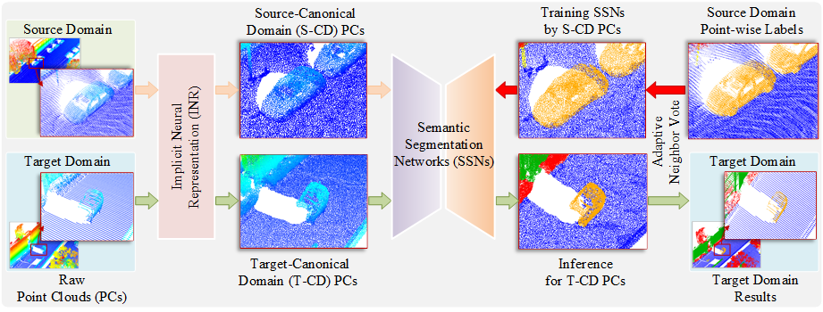

# CrossSensorAdaptiveSemanticSeg
This is an implement of our work on Cross-Sensor Adaptive Semantic Segmentation for Mobile Laser Scanning Point Clouds Based on Continuous Potential Scene Surface Reconstruction. 

## Introduction:

In this work, we proposed a new point-level distribution alignment based on continuous potential scene surface reconstruction by using an implicit neural representation framework. This is a plug-and-play framework and can be used for different existing semantic segmentation backbones, e.g., the point cloud convolution-based KPConv, 3D sparse convolution-based MinkUNet, and transformer-based Point Transformer V3. This repo does not contain the source code of semantic segmentation backbones that can be found in other existing repos.

## Requirment:
    python==3.8
    pytorch==1.13.1+cu117
    torchvision==0.14.1+cu117
    numpy==1.24.3
    scipy==1.10.1
    configargparse==1.7

## Quick start:

1.Download checkpoint_100.tar and store it in the ./weights/

Accessing the network cloud drive to download pre trained models：checkpoint_100.tar
link: https://pan.baidu.com/s/1Ahi49JdoW1pDNvqH2dWcKQ?pwd=6666

2.run sh quick_start_sample.sh

3.View the canonical point cloud generated within the outputs

## Citation:

If you find this project useful for your research, please kindly cite our paper:

    Paper is coming...
    
